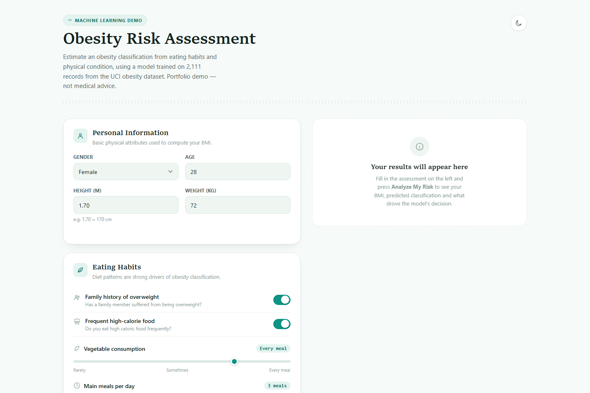

# Obesity Level Prediction


> A machine learning web app that predicts a person's obesity level from their lifestyle, diet, and demographic data — powered by a Random Forest classifier trained on the UCI Obesity Level dataset.



## Why This Exists

Obesity is driven by a complex mix of habits — diet, activity level, family history, even transportation choices — not just weight and height. This project trains a classifier on real survey data to show how those factors combine to predict one of seven obesity levels, then wraps it in a clean web interface so anyone can enter their own data and get an instant, explainable prediction.

## Features

- Predicts one of 7 obesity classes: Insufficient Weight, Normal Weight, Overweight Level I, Overweight Level II, Obesity Type I, Obesity Type II, Obesity Type III
- Calculates BMI and BMI category (Underweight / Normal / Overweight / Obese) alongside the model prediction
- Shows the full probability distribution across all 7 classes, not just the top prediction
- Displays feature importance so you can see which factors drove the prediction
- Health/wellness-themed UI with a BMI gauge highlighting the relevant weight zone
- Light and dark theme support
- Model trains automatically on server startup — no separate training step or saved model file needed

## Dataset & Model

The model is a `RandomForestClassifier` (scikit-learn, 200 estimators) trained on the [UCI Obesity Level Estimation dataset](https://archive.ics.uci.edu/dataset/544/estimation+of+obesity+levels+based+on+eating+habits+and+physical+condition) — 2,111 records covering individuals from Mexico, Peru, and Colombia.

**Test accuracy: 95.7%** on a held-out 20% split.

**16 input features:**

| Feature | Description |
|---|---|
| Gender | Male / Female |
| Age | Age in years |
| Height | Height in meters |
| Weight | Weight in kilograms |
| Family history with overweight | Whether a family member has/had overweight |
| FAVC | Frequent consumption of high caloric food |
| FCVC | Frequency of vegetable consumption |
| NCP | Number of main meals per day |
| CAEC | Consumption of food between meals |
| SMOKE | Whether the person smokes |
| CH2O | Daily water intake |
| SCC | Whether the person monitors calorie consumption |
| FAF | Physical activity frequency |
| TUE | Time spent using technology devices |
| CALC | Alcohol consumption frequency |
| MTRANS | Transportation method used |

**Target classes (7):** Insufficient Weight, Normal Weight, Overweight Level I, Overweight Level II, Obesity Type I, Obesity Type II, Obesity Type III

**Prediction output:** predicted obesity class, confidence score, BMI + BMI category, full probability distribution across all 7 classes, and feature importance ranking.

An exploratory data analysis and model comparison notebook (`Obesity Level Prediction.ipynb`) is also included, covering EDA, feature engineering, and comparisons against SVM, KNN, Decision Tree, Logistic Regression, and deep learning approaches.

## Tech Stack

| Category | Tools |
|---|---|
| Backend | Python, FastAPI, Uvicorn |
| Machine Learning | scikit-learn (Random Forest) |
| Data Processing | Pandas, NumPy |
| Templating | Jinja2 |
| Frontend | HTML, CSS, vanilla JavaScript |

## Run Locally

**Prerequisites**: Python 3.8+

```bash
git clone https://github.com/ErdoganPeker/Obesity-Level-Prediction.git
cd Obesity-Level-Prediction/app
```

Create and activate a virtual environment:

```bash
python -m venv .venv
.venv\Scripts\activate      # Windows
source .venv/bin/activate   # macOS/Linux
```

Install dependencies and start the server:

```bash
pip install -r requirements.txt
python main.py
```

The app trains the model on startup and serves at [http://localhost:5002](http://localhost:5002).

## Project Structure

```
Obesity-Level-Prediction/
├── Obesity Level Prediction.ipynb   # EDA, feature engineering, model comparison
├── Dockerfile
└── app/
    ├── main.py                              # FastAPI app, model training, /predict endpoint
    ├── requirements.txt
    ├── ObesityDataSet_raw_and_data_sinthetic.csv
    └── templates/
        └── index.html                       # Frontend UI
```

## Developer

**Erdoğan Yasin Peker**
[GitHub](https://github.com/ErdoganPeker) · [LinkedIn](https://www.linkedin.com/in/erdogan-yasin-peker-b107ba24b/)
